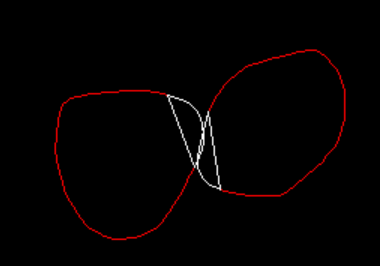

# SATOpti

## Introduction

While reading about collision detection between two convex polygons, I came across the SAT (Separating Axis Theorem) intersection test idea.

The basic idea behind this algorithm is simple: if there exists an axis along which the projections of both polygons do not overlap, then they do not intersect. To visualize this, one can project the vertices of both polygons onto lines that are perpendicular to the edges of the polygons. If, for all such axes, the projections do not overlap, the polygons do not intersect. If there is any axis where the projections do overlap, then the polygons are intersecting.

Many resources I found online suggest testing against all the edges, but this is not always necessary. Depending on the position and shape of the polygons, the test can be done against a reduced set of axes, which simplifies the calculation.
For example, in the image below, only the normals of the white edges need to be tested, while the normals of the red edges can be ignored.

This project has the goal of comparing the traditional SAT test with the new one.

Note: The above description of SAT is valid for polygons in 2D. For polygons in 3D or polyhedra, the test is slightly different and involves additional considerations

## TODO list
  

1. The PolygonComputeReducePol function for finding the vertex could be optimized. In addition, returning a polygon is unnecessary; an index interval should suffice.
2. The last edge test, corresponding to a diagonal of the polygon, might be skippable.
3. A debug mode, where one can write out and load polygon data, needs to be added. 

In addition, other convex polygon intersection tests, such as GJK or Chung–Wang, could be added

## Current results 

> Brute force with 500 vertices:
> - Average time with inter : 0.262911ms
> - Average time with no inter : 0.883101ms
> SAT with 500 vertices:
> - Average time with inter : 6.46251ms
> - Average time with no inter : 0.259675ms
> SAT opti with 500 vertices:
> - Average time with inter : 0.560346ms
> - Average time with no inter : 0.00115418ms

On my computer, the new method performs on average 10 (210) times faster than the typical SAT method for polygons with 500 vertices. However, in cases of intersection, it is 2.5 to 3 times slower on average than the brute force method.

The main reason is that the brute force method exits when it finds an intersection, while the SAT method exits when it finds a separation. This can be seen as in cases of no intersection, where the new method is 800 times faster than the brute force method.

Before choosing to use any method, one needs to understand its use case and choose the appropriate method.

Note: The new method does not provide any minimal vector translation to resolve collisions.

